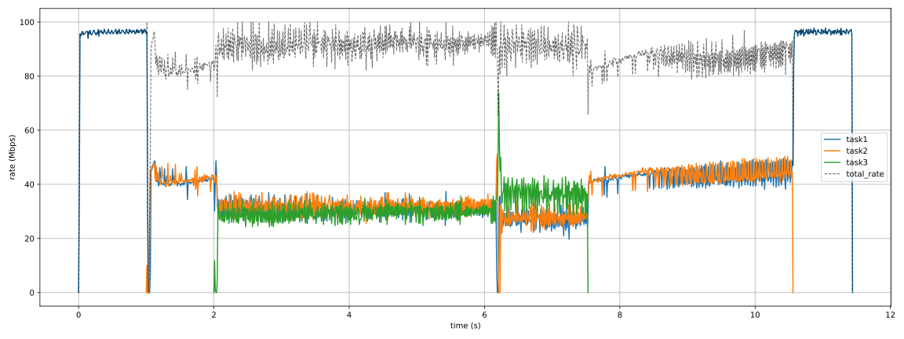
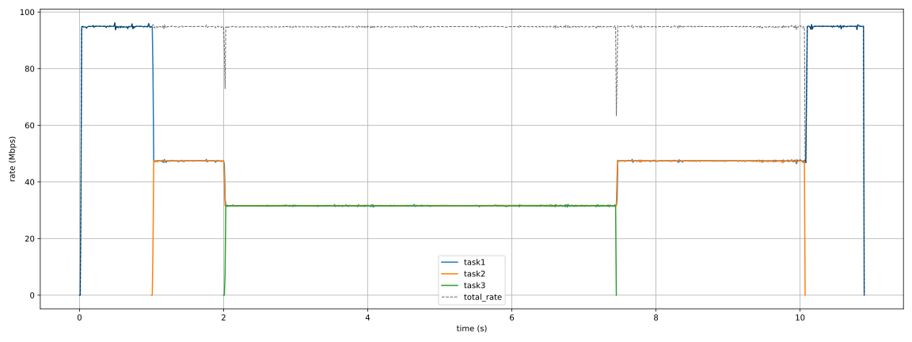
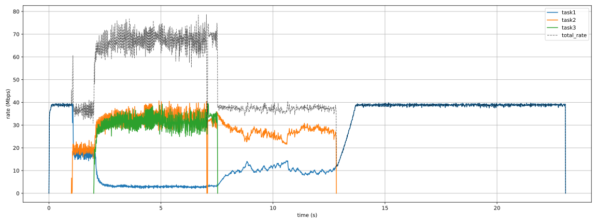
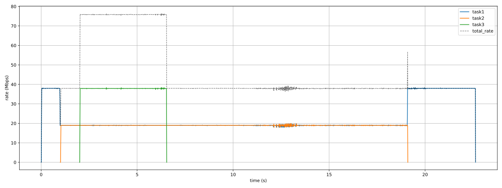
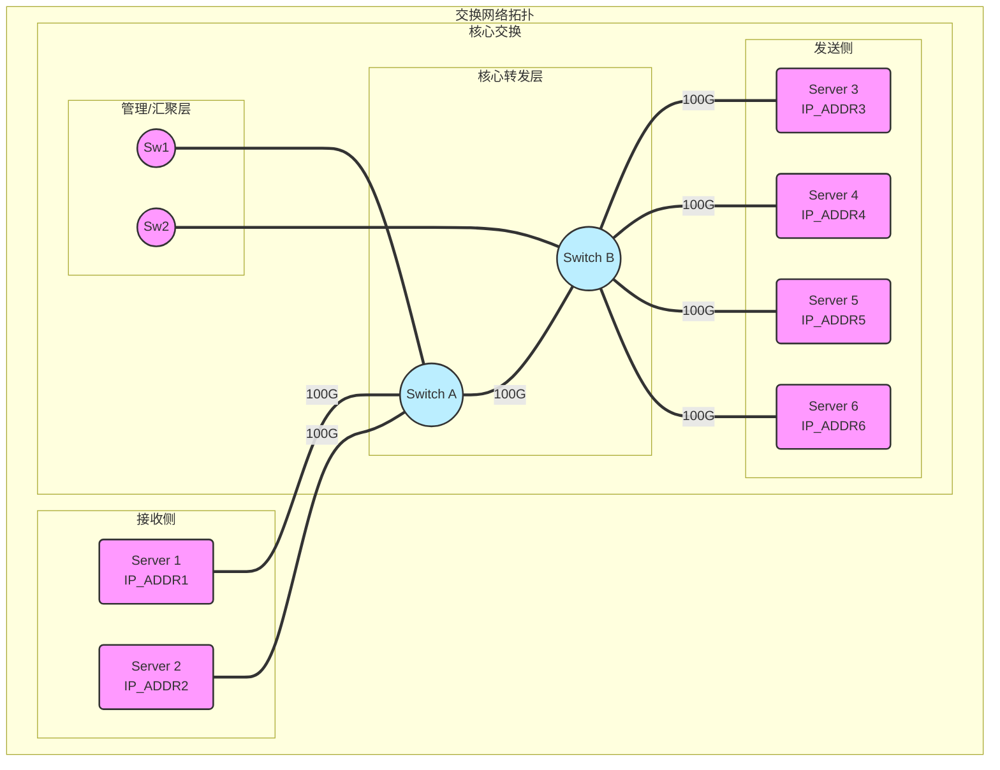

# LUCP扩展实验进度

- [x] 信令包ACL处理

- [x] 长距时延模拟
  - [x] 额外ACL重定向反向UDP dstPort 4791报文
  
  - [x] 在外挂主机上延迟发送
  
- [x] 瓶颈共享实验设计

  `switch1.conf`

  ```
  [Mac]
  b0:51:8e:f6:35:2f
  [Port]
  Ethernet48 95.0
  Ethernet49 95.0
  Ethernet50 95.0
  Ethernet4 95.0
  [Route]
  10.2.229.111 Ethernet48
  10.2.229.121 Ethernet49
  10.2.229.131 Ethernet50
  10.2.152.211 Ethernet4
  10.2.152.221 Ethernet4
  10.2.152.231 Ethernet4
  ```

  `local.conf`

  ```
  # Configuration File
  RdmaGidIndex = 3
  ListenPort = 52025
  MaxThreadNum = 16
  DefaultRate = 100
  BlockSize = 4 / 512
  BlockNum = 4096
  SavedFolderPath = /root
  # End of Configuration File
  ```

  `master.conf`

  ```
  10.2.152.231 10.2.152.231 10.2.229.131 52025 60G 0s
  10.2.152.221 10.2.152.221 10.2.229.131 52025 40G 1s
  10.2.152.211 10.2.152.211 10.2.229.111 52025 20G 2s
  ```

  
| 3ms RTT               | DCQCN                                        | LUCP                                        |
| :-------------------- | -------------------------------------------- | ------------------------------------------- |
| PFC frame             | 1,453,516                                    | 820                                         |
| PFC time              | 3,572,819                                    | 2502 unit                                   |
| 链路平均利用率        | 89.76Gpbs                                    | 94.33Gbps                                   |
| 总完成时间            | 11.44s                                       | 10.89s                                      |
| Jain’s Fairness Index | 0.991                                        | 0.999                                       |
| 实验图                |  |  |
- [x] 瓶颈区分实验设计

  `switch1.conf`

  ```
  [Mac]
  b0:51:8e:f6:35:2f
  [Port]
  Ethernet48 38.0
  Ethernet49 38.0
  Ethernet50 38.0
  Ethernet4 95.0
  [Route]
  10.2.229.111 Ethernet48
  10.2.229.121 Ethernet49
  10.2.229.131 Ethernet50
  10.2.152.211 Ethernet4
  10.2.152.221 Ethernet4
  10.2.152.231 Ethernet4
  ```

  `local.conf`

  ```
  # Configuration File
  RdmaGidIndex = 3
  ListenPort = 52025
  MaxThreadNum = 16
  DefaultRate = 100
  BlockSize = 4 / 256
  BlockNum = 4096
  SavedFolderPath = /root
  # End of Configuration File
  ```

  `master.conf`

  ```
  10.2.152.231 10.2.152.231 10.2.229.131 52025 60G 0s
  10.2.152.221 10.2.152.221 10.2.229.131 52025 40G 1s
  10.2.152.211 10.2.152.211 10.2.229.111 52025 20G 2s
  ```

  
| 3ms RTT               | DCQCN                                        | LUCP                                        |
| :-------------------- | -------------------------------------------- | ------------------------------------------- |
| 总完成时间            | 23.06s                                       | 22.63s                                      |
| Jain’s Fairness Index | 0.703                                        | 0.972                                       |
| 实验图                |  |  |
- [ ] 背景流实验设计与代码实现



